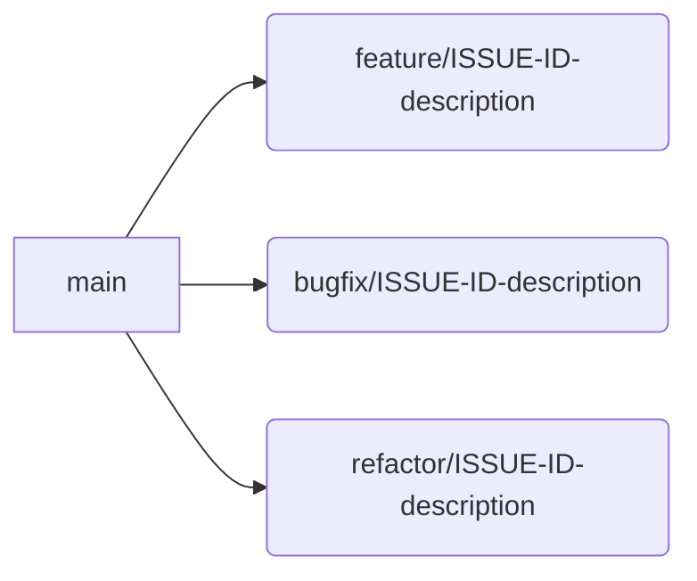

# CodeMosaic Contribution Guide

## Preamble
We welcome contributions adhering to the principles of academic rigor and engineering excellence that define this project. This document establishes canonical procedures for contributing to CodeMosaic's dynamic AST-based template assembly system. Contributions must maintain parity with our core architectural philosophy of minimal abstraction leakage.

## Development Environment
### Prerequisites
- Node.js v18.16.0 (LTS Hydrogen)
- PNPM v8.15.6
- AST Spec Compliance Engine v2.3.1

```bash
git clone https://github.com/codemosaic/core.git
cd core
pnpm install --frozen-lockfile
pnpm run verify-environment
```

### Architectural Overview
Contributors should understand these core subsystems before modification:
1. **Fragment Lexicon**: `/src/lexicon`  
   AST pattern registry with signature validation
2. **Mosaic Engine**: `/src/engine`  
   Stochastic assembler with combinatorial constraints
3. **Optimizer Pipeline**: `/src/optimization`  
   Abstract interpretation layer for template refinement

## Contribution Workflow
### Branching Strategy


### Commit Conventions
Follow [Conventional Commits](https://www.conventionalcommits.org) with strict type-scope formatting:
```
feat(engine): implement probability-weighted template selection
fix(lexicon): resolve ambiguities in FunctionDeclaration patterns
perf(optimization): reduce memory latency in AST cache
```

## Quality Assurance
### Test Requirements
| Test Type              | Coverage Target | Execution Command       |
|------------------------|-----------------|-------------------------|
| Unit                   | ≥85%            | `pnpm test:unit`        |
| Integration            | 100%            | `pnpm test:integration` |
| AST Conformance        | 100%            | `pnpm test:conformance` |
| Performance Benchmark  | Mandatory       | `pnpm test:benchmark`   |

### Static Analysis
- Prettier (`.prettierrc-atomic.json` configuration)
- ESLint (`airbnb-typescript` base with AST-specific rules)
- TypeScript Strict Mode (`tsconfig.strict.json`)

## Code Standards
### TypeScript Practices
1. **AST Node Interfaces**  
   All pattern matchers must implement `IASTPattern<T extends ts.Node>`
   ```typescript
   interface IFunctionPattern extends IASTPattern<ts.FunctionDeclaration> {
     validate: (context: TransformContext) => Diagnostic[];
   }
   ```
2. **Immutable Transformations**  
   All engine operations yield new AST instances
3. **Documentation Density**  
   1:1 ratio of executable code to JSDoc annotations

### Documentation Protocols
- Public API endpoints: TSDoc with `@category` and `@astSignature`
- Internal methods: JSDoc type annotations only
- Complex algorithms: LaTeX-style comments for formal proofs  
  ```
  // ∀f ∈ fragmentSet, ∃o ∈ optimizationPipeline | o(f) ∈ validAST
  ```

## Pull Request Guidelines
1. **Pre-Submission Checklist**
   - [ ] Verified against latest `main` branch
   - [ ] Rebased (no merge commits)
   - [ ] Performance impact assessment complete
   - [ ] Cross-browser AST conformance tests passed

2. **Review Requirements**
   - Minimum 2 maintainer approvals
   - Passing CI pipeline (Node.js LTS/Current matrix)
   - Benchmark comparison report

3. **Template Enforcement**
   ```markdown
   ## Summary
   [Semantic description following Conventional Commits]

   ## AST Impact Analysis
   [Modified node patterns, validation changes, transform effects]

   ## Performance Profile
   [Before/after metrics for critical paths]

   ### Verification Steps
   1. Checkout PR branch
   2. Execute `pnpm verify:full`
   3. Inspect benchmark artifacts...
   ```

## Code Review Philosophy
Reviews evaluate contributions against three pillars:
1. **Semantic Consistency**  
   No deviation from established AST manipulation paradigms
2. **Determinism**  
   All transformations must produce predictable outputs
3. **Compositionality**  
   Fragments maintain independence from assembly context

## Licensing
All contributions fall under the Cross-License Collaboration Agreement (CLCA). You will be prompted to sign our Contributor License Agreement upon first submission.

---

> **Important**  
> Experimental optimization strategies must include formal complexity analysis in `docs/optimization/`. Contact the Architecture Review Board (tech-review@codemosaic.io) for proposals altering core assembly algorithms.