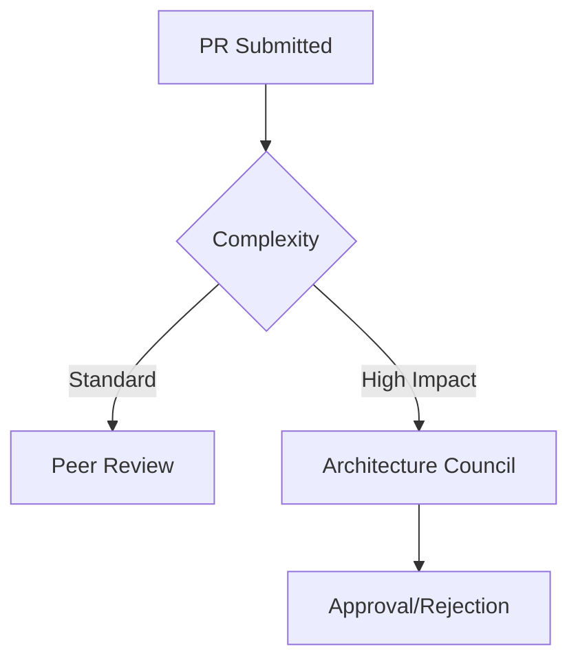

# CodeMosaic Pull Request Process

## Overview
This document specifies the standard operating procedure for submitting pull requests (PRs) to the CodeMosaic repository. All contributions must follow our AST-driven development paradigm and comply with the architectural guardrails established in RFC-2023-12 (CodeMosaic Pattern Matching Framework).

## Prerequisites
1. **Development Branch**: Create feature branches from `main` using the naming convention:  
   `feat/<jira-id>-<short-description>` or `fix/<gh-issue>-<short-description>`  
   Example: `feat/CMOS-42-ast-optimization`

2. **Code Standards**:
   - AST transformations must include corresponding `.mosaic` spec files
   - Boilerplate generation must decrease entropy by ≥15% (measured via `entropy-scanner`)
   - All pattern matches require validation through `MosaicValidator`

## PR Submission Protocol

### 1. Implementation Checklist
- [ ] Contains ≤1 logical change (atomic commits)
- [ ] Includes AST snapshot diffs (`mosaic diff --format=json`)
- [ ] Updates template registry (`/registry/v3/templates.yml`)
- [ ] Passes all metamorphic tests (`make metatest`)

### 2. Pull Request Composition
```markdown
## Change Summary
[Concise description focusing on AST impact]

### AST Pattern Changes
```mosaic
// Pattern matching specification
MATCH (FunctionDeclaration
  (id: Identifier) 
  (params: FormalParameters)
  (body: BlockStatement)
) REPLACE WITH {{functionTemplate}}
```

### Validation Evidence
- [ ] Baseline entropy: `4.2 sh`
- [ ] Post-change entropy: `3.1 sh`
- [ ] Validation report: [link_to_validator_output]

### Related Issues
Resolves #ISSUE_NUM
```

## Review Process

### 1. Automated Verification
PRs must pass:
- AST equivalence checks (`mosaic equivalence --strict`)
- Template consistency validation
- Entropy reduction audit

### 2. Human Review
- **Minimum Approvals**: 2 (1 Staff Engineer + 1 Principal)
- **Review Focus**:
  1. AST transformation correctness
  2. Boilerplate efficiency metrics
  3. Pattern registry consistency

### Review Escalation Path


## Post-Merge Procedures

1. **Template Propagation**: Approved changes automatically trigger:
   - Registry version bump (+0.0.1 minor)
   - Documentation rebuild (`make docs-gen`)
   - NuGet package publication (if API changes)

2. **Branch Management**:
   - Feature branches purged after 72 hours
   - Hotfix branches retained for 30 days

## Exception Handling

| Exception Type                  | Resolution Path               |
|---------------------------------|-------------------------------|
| AST Matching Conflicts          | Create CMF (Conflict Markup File) |
| Entropy Reduction Violations    | Request entropy variance permit |
| Registry Version Collisions     | Initiate registry mediation    |

All contributors must comply with the CodeMosaic Contribution Covenant (v4.1). Violations will trigger automated governance workflows.