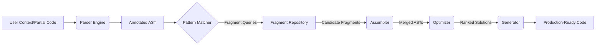

# CodeMosaic Architectural Overview  
**Version 0.8.1 | Stable**  

## Introduction  
CodeMosaic is a metaprogramming framework designed to dynamically assemble type-safe, contextually optimized boilerplate code from fragmented, reusable templates. Its architecture combines abstract syntax tree (AST) manipulation, pattern-driven fragment selection, and combinatorial optimization to minimize cognitive load and manual effort traditionally associated with scaffolding repetitive code structures.  

The system operates on three foundational pillars:  
1. **Declarative Fragment Definition**: Code templates are stored as structurally annotated AST subtrees.  
2. **Contextual Pattern Matching**: Structural relationships within target code prompt AST-based queries to retrieve compatible fragments.  
3. **Constraint-Guided Assembly**: A solver merges fragments while prioritizing correctness, type safety, and runtime efficiency.  

---

## Core Components  

### 1. Parser Engine  
- **Responsibility**: Converts raw source code (Python/TypeScript/Java) into technology-agnostic annotated ASTs.  
- **Key Features**:  
  - Grammar-agnostic parsing via tree-sitter  
  - Contextual token tagging (e.g., type annotations, execution boundaries)  
  - Syntactic validation at ingestion (fragments) and generation (output) phases  

### 2. Fragment Repository  
- **Structure**: Versioned storage of reusable code units as serialized annotated ASTs.  
- **Annotations Include**:  
  - Input/output type signatures  
  - Cross-fragment compatibility markers  
  - Performance complexity tags (e.g., `O(n²)`, `IO-bound`)  
  - Platform/version constraints  

### 3. Pattern Matcher  
- **Matching Mechanism**:  
  - Accepts AST subgraphs from user context or partial code as query input  
  - Performs subgraph isomorphism checks against fragment repository using Ullmann's algorithm variant  
- **Query Language**:  
  - Declarative JSON-based DSL specifying structural patterns (node types, adjacency, type flows)  
  - Support for wildcards (*) and template variables  

### 4. Assembler  
- **Core Logic**: Generates candidate merged ASTs from matched fragments.  
- **Conflict Resolution**:  
  - Namespace collision avoidance via deterministic renaming  
  - Type incompatibility backtracking  
  - Topological sorting of execution dependencies  

### 5. Optimizer  
- **Stages**:  
  1. **AST Simplification**: Constant folding, dead code elimination  
  2. **Idiomatic Rewriting**: Language-specific best practices enforcement  
  3. **Cost-Based Selection**: Scores candidates by weighted metrics (readability, runtime, memory)  

### 6. Generator  
- **Output Handling**:  
  - Converts optimized AST to target language syntax  
  - Applies project-specific style guides and formatting rules  
  - Validates syntactic correctness via round-trip parsing  

---

## Inter-Component Workflow  

1. **Ingestion Phase**: Source fragments are parsed, analyzed, and stored as optimized ASTs.  
2. **Query Phase**: Target code patterns trigger repository-wide subgraph searches.  
3. **Assembly Phase**: Valid fragment combinations generate intermediate AST candidates.  
4. **Optimization Phase**: Candidates undergo transformations and objective ranking.  
5. **Generation Phase**: The highest-ranked AST is serialized into executable code.  

---

## Design Constraints  
- **Immutability**: All ASTs are persisted as immutable structures. Variants generate new hashes.  
- **Determinism**: Assembly and optimization produce identical outputs for identical inputs.  
- **Extensibility**: Component interfaces (e.g., new optimizers, parsers) follow strict plugin contracts.  

## Final Output Characteristics  
- **Correctness**: AST-based assembly prevents syntactic errors by construction.  
- **Adaptability**: Fragment combinations adapt to project-specific linter rules and style guides.  
- **Traceability**: Generated code includes metadata linking output segments to originating fragments.  

---  
**Next**: Runtime configuration protocols and performance heuristics → `/wiki/core-concepts/runtime.md`  