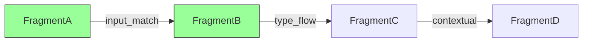

# CodeMosaic Data Model

## 1. Introduction
The CodeMosaic data model provides the structural foundation for dynamic code fragment assembly. This ontology defines how abstract syntax tree (AST) elements are decomposed, indexed, and reassembled into optimized boilerplate templates. The model emphasizes three core principles: AST isomorphism preservation, compositional flexibility, and optimization traceability.

## 2. Core Components

### 2.1 AST Node Schema
The atomic unit of representation is defined as:
```json
{
  "nodeId": "UUIDv4",
  "type": "AST_Node_Type",
  "properties": {
    "position": {"start": int, "end": int},
    "flags": ["volatile", "pure", "side_effect"],
    "metadata": {...}
  },
  "children": ["nodeId"]
}
```
- **Type**: Classifies node according to target language specification (e.g., `FunctionDeclaration`, `ClassProperty`)
- **Properties**: Contain positional, behavioral, and semantic metadata
- **Children**: Ordered list of child node references

### 2.2 CodeFragment Structure
```json
{
  "fragmentId": "SHA3-256",
  "astRoot": "nodeId",
  "interface": {
    "inputSlots": ["type:Constraint"],
    "outputSlots": ["type:Guarantee"]
  },
  "metrics": {
    "cyclomatic": float,
    "memoryProfile": "enum"
  }
}
```
- **FragmentId**: Cryptographic hash of normalized AST structure
- **Interface**: Declares semantic constraints for composition
- **Metrics**: Quantitative characteristics used during optimization

### 2.3 TemplateGraph Definition

A directed graph where:
- Nodes represent executable CodeFragments
- Edges specify compatibility relationships (weighted by type affinity)
- Subgraphs define optimization pathways through:
  - Edge weights (0.0-1.0 compatibility scores)
  - Node rankings (cost-benefit metrics)

### 2.4 MosaicContext Object
```json
{
  "constraints": {
    "targetRuntime": "Node18",
    "memoryLimit": "2GB",
    "sideEffects": "disallow"
  },
  "typeMapping": {
    "UserInput": "ValidatedString",
    "Response": "EncryptedPayload"
  },
  "variables": ["req:IncomingMessage", "res:ServerResponse"]
}
```
Provides dynamic execution context during template assembly with:
- Runtime environment constraints
- Type system mappings
- Variable propagation rules

## 3. Data Flow Architecture

1. **Parsing Phase**: Source input → Language-specific AST
2. **Fragmentation**: AST decomposition into canonical CodeFragments
3. **Graph Construction**: 
   - Fragments → TemplateGraph nodes
   - Edge creation via interface compatibility analysis
4. **Optimization Passes**: 
   - Cost-based graph pruning (complexity thresholds)
   - Contextual adaptation (MosaicContext application)
5. **Template Synthesis**: Linearization of optimal graph pathway

## 4. Versioning Schema
All data structures implement:
```json
{
  "$schema": "https://codemosaic.dev/schema/v2.1/data-model",
  "version": {
    "major": 2,
    "minor": 1,
    "compatibility": {"v1.x": "migration-path-v1.md"}
  }
}
```

## 5. Invariant Preservation
Key model invariants:
1. Fragment Determinism: 
   ```math
   \forall f \in Fragments, hash(f_{normalized}) \implies uniqueID
   ```
2. Composition Safety: 
   ```math
   Fragment_A \rightarrow Fragment_B \iff interfacesMatch(A_{output}, B_{input})
   ```
3. Optimizability: 
   ```math
   \exists \pi \in TemplateGraph : cost(\pi) \leq threshold(c)
   ```

This data model enables CodeMosaic's capability to generate context-aware, optimally composed code templates while maintaining strict semantic consistency.