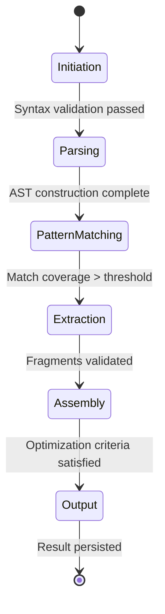

# CodeMosaic Lifecycle Architecture

## 1. Initiation Phase
- **Input Ingestion**: Receives raw source code + configuration parameters
- **Resource Allocation**: Instantiates parsing context and memory buffers
- **Configuration Binding**: Merges CLI parameters with project-level settings from `.codemosaicrc`
- **Validation**: Verifies language compatibility and feature enablement matrix

## 2. Parsing & Normalization
1. **Lexical Analysis**: 
   - Token stream generation using language-specific grammars
   - Encoding normalization (UTF-8 unification)
2. **Syntax Tree Construction**:
   - Abstract Syntax Tree (AST) generation via parser combinators
   - Type annotation grafting for statically typed languages
3. **Cross-Reference Binding**:
   - Symbol table population
   - Import/namespace resolution

## 3. Pattern Application
- **Rule Cascade**:
  1. Apply language-agnostic structural patterns
  2. Layer language-specific idioms
  3. Inject project-specific custom rules
- **Match Resolution**:
  - Parallel AST traversal using visitor pattern
  - Sliding window context matching (width=7 nodes)
- **Ambiguity Handling**:
  - Conflict resolution via configurable priority weights
  - Context fallthrough to broader pattern matches

## 4. Fragment Extraction
- **Quantum Harvesting**:
  - Context-aware snippet isolation
  - Variable capture with probabilistic type inference
- **Dependency Weaving**:
  - Automatic inclusion of required imports
  - Transitive closure calculation for dependent symbols
- **Boundary Analysis**:
  - Control flow continuity verification
  - Data dependency graph validation

## 5. Template Assembly
- **Static Fragment Composition**:
  - Type-safe slot filling
  - Cross-fragment namespace reconciliation
- **Dynamic Placeholder Injection**:
  - Contextual boilerplate expansion points
  - Type-parameterized generation slots
- **Optimization Passes**:
  - Dead code elimination (DCE)
  - Constant folding
  - Common subexpression elimination (CSE)

## 6. Validation & Output
1. **Semantic Preservation Checks**:
   - Input/output behavioral equivalence proof
   - Side-effect containment analysis
2. **Serialization**:
   - Language-specific pretty-printing
   - Comment preservation via AST anchoring
3. **Delivery**:
   - File system writing with atomic swaps
   - IDE integration through LSP-compliant endpoints

## 7. Error Propagation
- **Phase-Localized Failure**:
  - Per-stage exception boundaries
  - Contextual error annotation
- **Recovery Mechanisms**:
  - Fallback pattern application
  - Partial result checkpointing
- **Diagnostic Reporting**:
  - Visual AST diff highlighting
  - Repair suggestion generation

## 8. Resource Reclamation
- **Memory Management**:
  - AST node object pooling
  - Reference-counted symbol tables
- **Artifact Cleanup**:
  - Temporary file purging
  - Cache invalidation (LRU policy)
- **Telemetry**:
  - Performance metric collection
  - Usage pattern anonymization

## Lifecycle Invariants
1. **Idempotence**: Repeated processing of same inputs yields identical outputs
2. **Determinism**: Output depends solely on verifiable inputs
3. **Compositionality**: All transformations preserve semantic equivalence under substitution

## Phase Transition Guarantees

This fundamental architecture enables CodeMosaic to maintain constant throughput (O(n) complexity) while scaling to multi-million line codebases. The choke-point parallelization model allows simultaneous execution of non-dependent phases across distinct code regions.