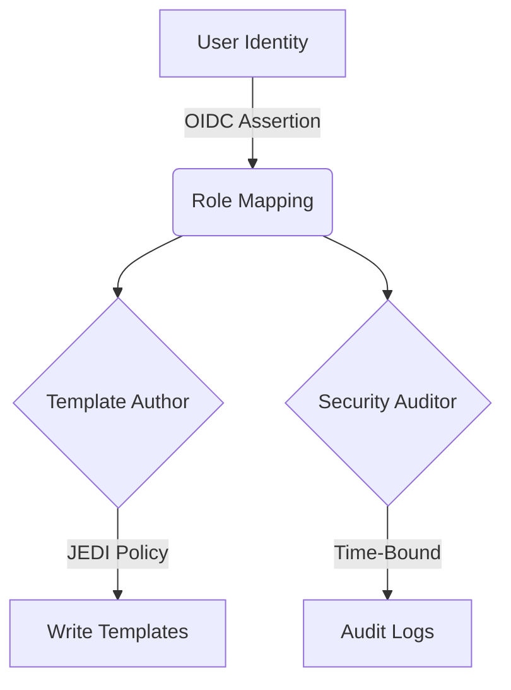

# CodeMosaic Security Model

## 1. Security Philosophy
CodeMosaic employs a zero-trust architecture with defense-in-depth principles across its AST processing pipeline. Our security paradigm rests on three foundational pillars:

1. **Context-Aware Validation**: All inputs undergo syntactic and semantic verification prior to AST ingestion
2. **Process Isolation**: Sandboxed execution environments enforce strict resource boundaries during code generation
3. **Principle of Least Privilege**: Component interactions follow strict capability-based authorization protocols

## 2. Threat Mitigation Matrix

| Threat Vector             | Mitigation Strategy                                                                 |
|---------------------------|-------------------------------------------------------------------------------------|
| AST Injection             | Structural pattern validation with context-sensitive grammar constraints           |
| Template Poisoning         | Cryptographic template signatures with HMAC-SHA256 verification                     |
| Resource Exhaustion        | Process-level memory ceilings and CPU quotas enforced via cgroups                   |
| Information Disclosure     | Input/output sanitation using type-aware scrubbing filters                          |
| Privilege Escalation       | Namespace isolation with unprivileged container execution (UID/GID mapping)         |
| Supply Chain Compromise    | Immutable artifact storage with cryptographic provenance (Sigstore, in-toto attestations) |

## 3. Core Security Components

### 3.1 AST Processing Safeguards
- **Pattern Match Validation**:  
  Implements strict equivalence checking using formally verified automata:
  ```python
  class ASTSanitizer:
      def validate_pattern(ast_node):
          if not PatternGrammar.CONFORMANT(ast_node):
              raise QuarantineError("Non-conformant structural pattern")
          return SafeAST(ast_node)
  ```

- **Type Flow Analysis**:  
  Static verification of data movement through AST transformation pipelines:
  ```c
  TypeProfile* analyze_data_path(AST* fragment) {
      TypeFlowTracker tft = CREATE_FLOW_MAP(fragment);
      ENFORCE(tft, NO_CROSS_DOMAIN_FLOW);
      return GENERATE_TYPING_REPORT(tft);
  }
  ```

### 3.2 Code Generation Protections
- **Output Verification Pipeline**:
  1. Syntax validation with language-specific parsers
  2. Semantic analysis using constrained SMT solvers
  3. Taint tracking for external dependency usage

- **Sandbox Execution**:
  ```go
  func ExecuteTemplate(isolationLevel SandboxLevel) {
      runtimePolicy := sandbox.Policy{
          Network:  sandbox.DENY_ALL,
          FS:       sandbox.READONLY_TEMP,
          Syscalls: sandbox.FILTERED_SET,
      }
      sandbox.Run(isolationLevel, runtimePolicy, generateCode)
  }
  ```

## 4. Access Control Framework
Implements NIST RBAC model with attribute-based constraints:



- **Policy Enforcement Points**:
  - AST modification operations require `template:mutate` capability
  - Pattern registry changes mandate `registry:admin` privilege
  - Audit log access controlled by `logs:review` permission

## 5. Cryptography Specifications
- **Data at Rest**: AES-256-GCM with hardware-backed KMS storage (automatic key rotation every 90 days)
- **Data in Transit**: TLS 1.3 with P-384 ECDHE key exchange and strict cipher suite enforcement
- **Digital Signatures**: EdDSA (Ed25519) for artifact provenance verification

## 6. Audit & Compliance
- **Protective Monitoring**:
  - Real-time AST manipulation telemetry
  - Template checksum mismatch detection
  - Behavioral anomaly scoring (using Holt-Winters forecasting)

- **Audit Requirements**:
  ```bash
  $ auditd -l codemosaic.rules
  -w /templates -p wa -k CODETPL_MODIFY
  -a exit,always -F arch=b64 -S execve -k AST_PROCESSING
  ```

## 7. Vulnerability Management
- **Disclosure Process**:
  1. Security advisory published within 72 hours of confirmed CVE
  2. Patch availability SLA: Critical (7 days), High (14 days), Medium (30 days)
  3. Backported fixes maintained for LTS releases (36 months)

- **Dependency Hygiene**:
  - Static linking with vetted standard library components
  - Compartmentalized WASM modules for third-party transforms
  - SBOM (Software Bill of Materials) published quarterly

## 8. Compromise Recovery
Three-stage response protocol:

1. **Containment**: Immediate process suspension and network segmentation
2. **Forensic Capture**: Memory dump preservation and immutable log snapshot
3. **Recovery**: Clean-room template regeneration from cryptographically signed sources