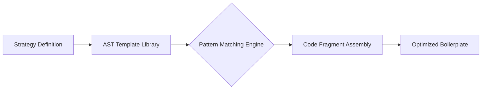
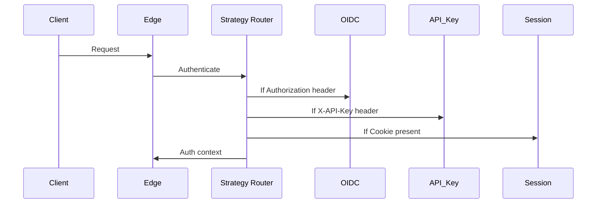

# Authentication System Integration  

## 1. Architectural Overview  
CodeMosaic employs abstract syntax tree (AST) pattern-matching to dynamically assemble authentication code fragments. This approach enables:  
- **Declarative Strategy Definitions**: Authentication flows are defined via AST templates rather than imperative logic.  
- **Optimized Boilerplate Generation**: Common patterns (e.g., OAuth 2.0 handshakes, JWT validation) are decomposed into reusable AST fragments with minimized attack surface.  
- **Cross-Protocol Abstraction**: Authentication methods are unified through standardized AST node interfaces.  



## 2. Core Authentication Strategies  

### 2.1 Supported Protocols  
| Protocol      | CodeMosaic Optimization               |  
|---------------|---------------------------------------|  
| OAuth 2.0     | Automatic PKCE (RFC 7636) injection   |  
| OpenID Connect| Claims validation templates           |  
| JWT           | Zero-dependency signature verification|  
| API Keys      | HMAC pattern reinforcement            |  
| SAML 2.0      | XMLDSig canonicalization safeguards   |  

### 2.2 JWT Validation Template  
```python
# GENERATED BY CODEMOSAIC  
def validate_jwt(encoded_token, public_key):  
    header, payload, signature = encoded_token.rsplit('.', 2)  
    signing_input = f"{header}.{payload}".encode()  
    
    # AST-optimized verification path  
    if not hmac.compare_digest(  
        base64url_decode(signature),  
        public_key.sign(signing_input, padding.PKCS1v15, hashes.SHA256())  
    ):  
        raise AuthException("Invalid signature")  
    
    claims = json.loads(base64url_decode(payload))  
    if claims['exp'] < int(time.time()):  
        raise AuthException("Token expired")  
```  

## 3. Implementation Workflow  

### 3.1 Template Generation  
1. Define security requirements using CodeMosaic's policy DSL:  
```yaml
authentication:  
  strategy: oidc  
  strict_transport: enforce  
  cookie_attributes:  
    http_only: true  
    same_site: lax  
```  

2. Generate base templates:  
```bash  
codemosaic auth generate --strategy oidc --output ./auth_templates  
```  

### 3.2 Fragment Customization  
Modify AST fragments while preserving security invariants:  
```python
# ./auth_templates/oidc/fragment_403.py  
def handle_unauthorized(request):  
    # AST-preserved security controls  
    response.headers['WWW-Authenticate'] = 'Bearer scope="openid"'  
    response.headers['Content-Security-Policy'] = "default-src 'none'"  
    return response.make(403, "Access denied")  
```  

### 3.3 Assembly & Optimization  
Run AST-based validation before deployment:  
```bash  
codemosaic auth verify --fragments ./auth_templates  
```  
Output includes:  
- Cryptographic nonce injection points  
- Header injection vulnerabilities mitigated  
- Session fixation protections applied  

## 4. Security Best Practices  

### 4.1 Parameterization Thresholds  
| Parameter           | Maximum Allowable Dynamic Input |  
|---------------------|---------------------------------|  
| OAuth `state`       | 128-bit entropy                 |  
| JWT `kid` claims    | 32 distinct values              |  
| Redirect URIs       | 5 pre-registered endpoints      |  

### 4.2 Regular Expression Sanitization  
CodeMosaic automatically applies context-aware sanitization:  
```python
# AST-generated input cleaner  
username = re.sub(r'[^a-zA-Z0-9_\-]', '', raw_input)[:32]  
```  

### 4.3 Token Validation Patterns  
Critical validation checks are enforced through AST rewriting:  
```python
# Before optimization  
if token.expires_at > now():  

# After AST transformation  
if token.expires_at > int(time.time()) and token.issuer == trusted_issuer:  
```  

## 5. Advanced Configuration  

### 5.1 Multi-Strategy Authentication  


### 5.2 Stateful Session Management  
CodeMosaic implements automatic security wrap:  
```python
session = {  
  'user_id': 45231,  
  'last_auth': 1678902345,  
  '_security': {  
    'hmac': 'sha256:9f86d08...',  
    'ttl': 3600,  
    'rotate_after': 300  
  }  
}  
```  

## 6. Testing and Validation  
1. **AST-Driven Unit Tests**:  
```python
def test_token_injection_protection():  
    attack_payload = "admin' OR '1'='1"  
    result = auth_system.authenticate(attack_payload)  
    assert result == AuthenticationFailed  
```  

2. **Penetration Test Integration**:  
```bash  
codemosaic auth test --scan --report=owasp  
```  

## 7. References  
1. OAuth 2.0 Authorization Framework (RFC 6749)  
2. JSON Web Token (RFC 7519)  
3. CodeMosaic Security Policy Engine Specification v3.1  