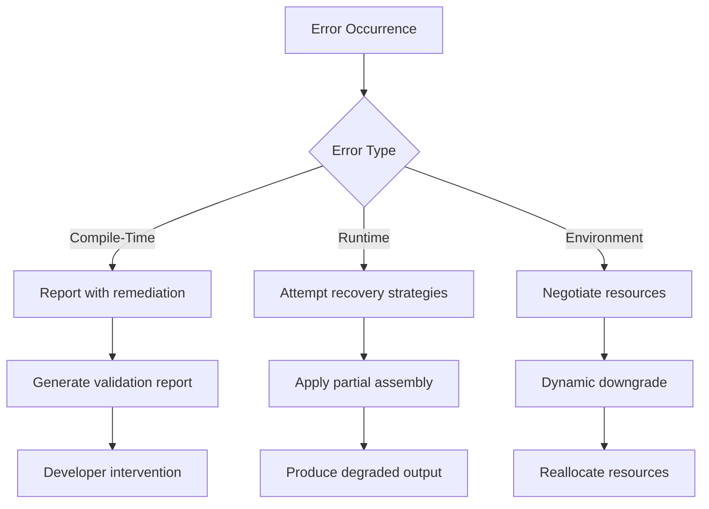

# Error Handling in CodeMosaic

## Conceptual Framework
Error mitigation in CodeMosaic operates through three orthogonal control planes:

1. **Template Validation Layer**
   - Static analysis of AST pattern definitions
   - Schema compliance checks
   - Context-free grammar verification

2. **Fragment Assembly Layer**
   - Dynamic constraint resolution
   - Cross-fragment dependency validation
   - Type propagation analysis

3. **Execution Context Layer**
   - Environment compatibility checks
   - Resource availability verification
   - Security policy enforcement

## Error Taxonomy

### 1. Compile-Time Validation Errors
Occur during template parsing and AST schema validation:

```json
{
  "error_code": "CM404",
  "severity": "critical",
  "ast_node": "PatternBinding[23]",
  "diagnostic": "Type mismatch in output specifier",
  "expected": "Map<Symbol, FunctionType>",
  "actual": "Vector<AnyType>",
  "remediation": "Apply explicit type coercion via :: operator"
}
```

### 2. Runtime Resolution Errors
Manifest during fragment assembly:

```json
{
  "error_code": "CM211",
  "phase": "fragment_assembly",
  "constraint_id": "CT-9A3F",
  "unresolved_variables": ["$user_input::sanitized", "$db_connection::active"],
  "dependency_chain": [
    "Fragment#7 -> Template::UserAuthV3",
    "Fragment#12 -> Template::DBConnPool"
  ],
  "context_snapshot": "partial (78% resolved)"
}
```

### 3. Execution Environment Errors
System-level constraints:

```json
{
  "error_code": "CM503",
  "resource": "WASM_Runtime",
  "constraint_violation": "MemoryLimit(256MB)",
  "actual_usage": "281MB",
  "trace_path": "/system/boundaries/memory#L342"
}
```

## Mitigation Strategies

### A. Template Validation Failures
1. Use the schema verifier:
   ```bash
   codemosaic verify --template=user_auth.cmt --strict
   ```
2. Enable live typechecking in development mode:
   ```markdown
   
     development:
       typecheck: aggressive
       ast_validation: parallel
   ```

### B. Fragment Assembly Errors
1. Activate constraint debugging:
   ```bash
   codemosaic assemble --debug-constraints=CT-9A3F --trace-variables
   ```
2. Apply partial assembly fallback:
   ```python
   AssemblyContext(
       fail_strategy=ContinueWithPlaceholders,
       partial_output=Allow(threshold=0.65)
   )
   ```

### C. Environment Errors
1. Preflight check routine:
   ```bash
   codemosaic check-environment --full-diagnostics
   ```
2. Resource negotiation patterns:
   ```javascript
   ResourcePolicy.define({
       memory: ElasticBoundary(
           preferred: "200MB",
           negotiable_up_to: "300MB",
           fallback: "ReduceCodeCache"
       )
   })
   ```

## Debugging Methodology

### 1. AST Visualization
Generate interactive AST diagrams for error context:
```bash
codemosaic debug --visualize-error=CM404 --output=error_ast.html
```

### 2. Constraint Backtracing
Follow variable resolution paths:
```bash
codemosaic trace CT-9A3F --show-resolution-path
```

### 3. Context Simulation
Replay errors in isolated environments:
```bash
codemosaic replay-error CM211 --snapshot=assembly_context.cmsnap
```

## Anti-Patterns

1. **Type Ambiguity**
   ```markdown
   !!! danger "Invalid"
     $user_input :: Unsanitized
   ```
   ```markdown
   !!! success "Valid"
     $user_input :: String<Sanitized[HTML]>
   ```

2. **Hard Resource Assumptions**
   ```markdown
   !!! danger "Invalid"
     requires: FixedMemory("512MB")
   ```
   ```markdown
   !!! success "Valid"
     requires: MemoryRange(min="128MB", preferred="256MB")
   ```

## Exception Handling Hierarchy



## Further Reading
- [CodeMosaic Constraint Resolution System](wiki/core/constraint_resolution.md)
- [AST Validation Reference](wiki/reference/ast_validation.md)
- [Resource Negotiation Protocols](wiki/advanced/resource_negotiation.md)